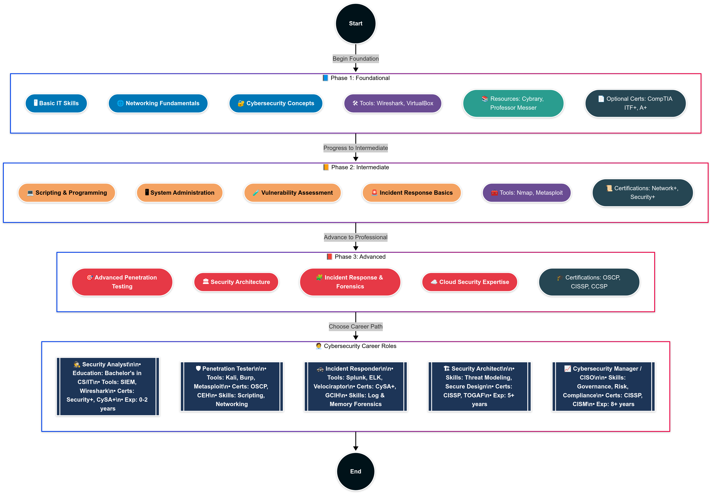

# 🛡️ Cybersecurity Roadmap: From Non-Technical Beginner to Advanced Expert

This comprehensive roadmap is designed to take you from having no technical background to becoming an advanced cybersecurity expert. It’s divided into three progressive phases and includes skills, tools, YouTube channels, certifications, and hands-on resources. Whether you want to become a penetration tester, security analyst, or cloud security engineer, this guide is your path forward.

---

---

## 📘 Phase 1: Foundational (Non-Technical to Basic Technical Skills)

**🎯 Goal**: Build a solid base in IT and cybersecurity fundamentals.  
**👤 For**: Absolute beginners  
**⏳ Duration**: 3–6 months

### 🔍 What to Learn
- **Basic IT Skills**: Hardware, OS navigation, file systems
- **Networking Fundamentals**: IP addressing, DNS, HTTP, OSI model
- **Cybersecurity Basics**: Threat types, security hygiene, encryption

### 🛠 Tools to Learn
- Wireshark
- VirtualBox / VMware
- Windows CMD & Linux Terminal

### 🎓 Resources
- **Cybrary** – Intro to IT & Cybersecurity
- **Professor Messer** – A+ & Network+ YouTube courses
- **Khan Academy** – Computer Science basics

### ▶️ YouTube Playlists
- [WsCube Tech – Cybersecurity Full Course (Hindi)](https://youtu.be/v3iUx2SNspY?si=sEvDax-oD667r9if)
- [Professor Messer – CompTIA A+](https://www.youtube.com/playlist?list=PLG49S3nxzAnmpdmxJ2yJhjCxdQ0g2ndX7)
- [NetworkChuck – Networking for Beginners](https://www.youtube.com/watch?v=3bC2cN8aU5E)
- [The Cyber Mentor – Cybersecurity for Beginners](https://www.youtube.com/watch?v=U_P23SqJaDc)

### 🧪 Practice
- Install Linux in VirtualBox
- Use Wireshark to inspect traffic
- Try basic terminal commands

### 🏅 Certifications (Optional)
- CompTIA ITF+
- CompTIA A+

---

## 🧠 Phase 2: Intermediate (Technical Skills and Specialization)

**🎯 Goal**: Begin specializing and gain practical skills  
**👤 For**: Those with basic IT knowledge  
**⏳ Duration**: 6–12 months

### 🔍 What to Learn
- **Programming**: Python, Bash, PowerShell
- **System Administration**: Linux/Windows configs, firewalls
- **Vulnerability Assessment**: Network and system scanning
- **Incident Response Basics**

### 🛠 Tools to Learn
- Nmap  
- Metasploit  
- Burp Suite  
- Splunk or ELK Stack  

### 🎓 Resources
- **TryHackMe** – "Learn Linux", "Nmap", "Web Hacking 101"
- **Hack The Box** – Practical CTFs
- **Metasploit Unleashed**
- Books:  
  - *Python Crash Course*  
  - *The Hacker Playbook 3*

### ▶️ YouTube Playlists
- [Hak5 – Metasploit for Beginners](https://www.youtube.com/watch?v=7j2K8x2p茸)
- [LiveOverflow – Binary Exploitation](https://www.youtube.com/playlist?list=PLhixgUqwRTjxglIswKp9RBniVRYB68Cjt)
- [The Cyber Mentor – Practical Ethical Hacking](https://www.youtube.com/watch?v=3t4J5VuU8)

### 🧪 Practice
- Write a Python network scanner
- Set up and secure a Linux server
- Complete TryHackMe’s “Basic Pentesting” room

### 🏅 Certifications (Optional)
- CompTIA Network+
- CompTIA Security+
- CEH

---

## 🚀 Phase 3: Advanced (Specialization and Leadership)

**🎯 Goal**: Master a cybersecurity domain  
**👤 For**: Intermediate learners ready to specialize  
**⏳ Duration**: 1–2 years

### 🔍 What to Learn
- **Advanced Penetration Testing**: Exploit dev, red teaming  
- **Security Architecture**: Designing secure systems  
- **Incident Response & Forensics**  
- **Cloud Security**: AWS, Azure, IAM  

### 🛠 Tools to Learn
- Cobalt Strike  
- Advanced Wireshark  
- Splunk, QRadar  
- Volatility, Autopsy, EnCase  

### 🎓 Resources
- **SANS Institute** – Advanced paid courses  
- **Pluralsight** – Advanced paths  
- **Offensive Security** – PWK/OSCP  
- Books:  
  - *Black Hat Python*  
  - *Web Application Hacker’s Handbook*

### ▶️ YouTube Playlists
- [ippsec – Hack The Box Walkthroughs](https://www.youtube.com/c/ippsec)
- [John Hammond – Advanced Challenges](https://www.youtube.com/c/JohnHammond010)
- [SANS IR Series](https://www.youtube.com/playlist?list=PLZ6t1w2o7iB9x9)

### 🧪 Practice
- Complete a “Hard” HTB box  
- Use Volatility to analyze memory dumps  
- Build secure cloud infrastructure in AWS

### 🏅 Certifications (Optional)
- OSCP  
- CISSP  
- CCSP  

---

## 💼 Cybersecurity Career Paths

| Role                | Requirements                          | Tools                       | Certifications              |
|---------------------|---------------------------------------|-----------------------------|-----------------------------|
| **Security Analyst** | Log analysis, SIEM, scripting          | Splunk, ELK, Wireshark      | Security+, CEH, GCIH        |
| **Penetration Tester** | Exploits, web/app hacking             | Metasploit, Burp, Nmap      | CEH, OSCP, GPEN             |
| **Incident Responder** | Malware, logs, forensics              | Volatility, Autopsy, SIEM   | GCIH, CHFI, SANS FOR508     |
| **Cloud Security Engineer** | AWS/Azure security, IAM, policies | Terraform, AWS CLI, KMS     | CCSP, AWS Security Specialty |
| **SOC Analyst**     | SIEM, alerts, triage                  | QRadar, Splunk, Kibana      | Security+, CySA+            |
| **Red Team Operator** | Advanced exploits, stealth ops       | Cobalt Strike, Empire       | OSCP, CRTO                  |

---

## 🔗 Stay Connected & Learn Continuously

### 🧠 Communities:
- Reddit: r/netsec, r/hacking, r/cybersecurity
- Discord: TryHackMe, Hack The Box servers
- LinkedIn groups and CTF teams

### 📅 Stay Updated:
- Follow top blogs: KrebsOnSecurity, ThreatPost
- Twitter/X: Follow researchers & exploit devs

---

> 💬 **Pro Tip**: Cybersecurity is a journey. Practice regularly, join CTFs, document your learning, and don’t be afraid to break things in a lab!

---

## ✍️ Author
**Saurabh Subhash Kokate**  
GitHub: [kokatesaurabh](https://github.com/kokatesaurabh)  
Instagram: [0day.xploit_101](https://www.instagram.com/0day.xploit_101)  
LinkedIn: [Saurabh Kokate](https://www.linkedin.com/in/saurabh-kokate-b839b921a)  
X/Twitter: [SaurabhKokate20](https://x.com/SaurabhKokate20)

---

## 📂 License
This roadmap is open-source and available for educational use. Feel free to fork and modify for your personal learning or teaching curriculum.
